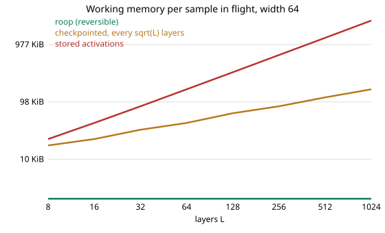

# weave: memory against depth

weave trains a network of leapfrog layers without storing activations. The
backward pass gets each layer's input back by running the layer backward, so
what it needs does not grow with depth. This page measures that against the usual
ways of doing it. Reproduce it with `python3 bench/weave_compare.py`.

## What is compared

One network (width 64, `weave::grad`) in the same integer arithmetic, run three
ways on 256 samples:

- **roop**: `grad`, whose backward pass rebuilds each layer's input with `uncall`.
- **stored**: a Rust version (`bench/native/weave.rs`) that keeps every layer's
  input state for every sample, then walks back reading them.
- **checkpointed**: the same, keeping every `sqrt(L)`-th layer's input and
  recomputing the layers in between a segment at a time.

The stored and checkpointed versions hold all 256 samples at once, as a framework
running a batch would. roop runs the samples one after another through the same
buffers; that is not a handicap but how its working state stays fixed, and it is
the difference being measured. The gradients agree exactly, to the last bit, in
every row. The table gives each process's peak resident memory, and what the
activations alone took in the two baselines:

| layers L | weights + gradients | roop: peak | stored: peak | stored: activations | checkpointed: peak | checkpointed: activations | same gradients |
|---:|---:|---:|---:|---:|---:|---:|:---|
| 8 | 0.5 MB | 6.5 MB | 5.8 MB | 2.1 MB | 4.9 MB | 1.6 MB | yes |
| 32 | 2.1 MB | 8.1 MB | 14.0 MB | 8.4 MB | 8.2 MB | 3.1 MB | yes |
| 128 | 8.5 MB | 14.5 MB | 47.0 MB | 33.6 MB | 17.7 MB | 6.0 MB | yes |
| 512 | 34.1 MB | 40.1 MB | 178.7 MB | 134.2 MB | 49.7 MB | 12.1 MB | yes |
| 1024 | 68.2 MB | 74.1 MB | 354.4 MB | 268.4 MB | 88.8 MB | 16.8 MB | yes |

Weights and gradients are the floor for all three, 68 MB at 1024 layers. roop sits
6 MB above it, the same at every depth: the program and the runtime. The stored
version grows by 0.26 MB a layer and reaches 354 MB, 4.8 times roop's. The
checkpointed version needs about `2 sqrt(L)` layers' worth, 89 MB, 1.2 times
roop's, at the price of running each layer's forward pass one more time.

The table above was measured on a quiet machine. It was rerun after weave's arithmetic
changed to the wide contractions and Q24 gradients, with the same result for roop: the
gradients still agree bit for bit with both baselines at every depth to 1024, and roop's
peak is still 74.1 MB at 1024 layers. That run was made while other work loaded the
machine, and its baseline peaks are not usable (the checkpointed one came out below the
weights it must hold, which means resident memory was being compressed), so the figures
above stand.

## What it is worth

- **Constant against linear, with nothing recomputed beyond what the backward
  pass already does.** Against checkpointing the saving is smaller and the price
  is different: checkpointing keeps a little and recomputes a lot of the forward
  pass, while roop keeps nothing and its backward pass is the inverse computation.
- **It depends on how many samples are in flight.** Run one sample at a time, the
  stored version's 268 MB of activations becomes 1 MB, and the difference is
  small: the ratio of activations to weights is about `2 / N` per layer and sample.
  The saving matters when the network is deep and the batch is processed together,
  or when memory is the limit.
- **Not claimed: speed.** This page measures memory and exactness. roop's
  `grad` runs about 750 samples a second at width 64 and 8 layers, the layer type,
  the loss and the adjoints are written by hand, and nothing here argues roop
  trains a network faster than the usual tools.
